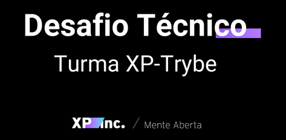
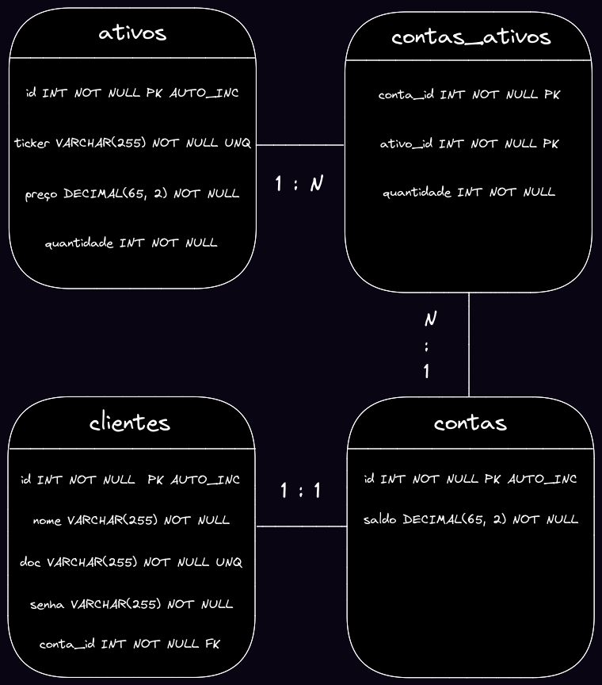
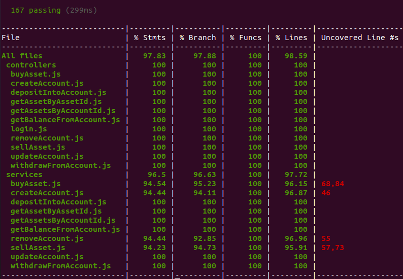

<div align="center">
  <a href="https://github.com/rhenanstoccozimmermann/xpinc-investments-api">
    
  </a>
  <h3 align="center">Desafio Técnico Turma XP - Trybe | XP Inc.</h3>
  <p align="center">
    Trata-se de desafio técnico proposto pela XP Inc. no processo seletivo da Turma XP - Trybe, no qual foi desenvolvido um aplicativo de investimento em ações, com algumas funcionalidades de conta digital.
  </p>
</div>


## Sumário

<ol>
  <li>
    <a href="#1-sobre-o-desafio">Sobre o desafio</a>
  </li>
  <li>
    <a href="#2-explicação-sobre-as-tomadas-de-decisão-no-projeto">Explicação sobre as tomadas de decisão no projeto</a>
  </li>
  <li>
    <a href="#3-instruções-sobre-como-executar-o-projeto">Instruções sobre como executar o projeto</a>
  </li>
  <li>
    <a href="#4-contato">Contato</a>
  </li>
</ol>


## 1. Sobre o desafio

Foi realizado o desafio de Back-End.

O desafio é composto dos seguintes requisitos:

### I) Requisitos mínimos gerais

#### a) Fazer um README.md que contenha:

- Uma explicação sobre as tomadas de decisão na abordagem do desafio;
- Instruções sobre como executar o projeto; e
- Outras informações importantes.

### II) Requisitos mínimos específicos

#### a) Desenvolver os endpoints listados abaixo:

- POST /investimentos/comprar
- POST /investimentos/vender
- GET /ativos/{cod-cliente}
- GET /ativos/{cod-ativo}
- POST /conta/deposito
- POST /conta/saque
- GET /conta/{cod-cliente}

Obs: os caminhos e nomes podem ser alterados pela pessoa candidata.

#### b) Criar uma lista de ações que passem as informações para o Front-End

- A API deverá retornar uma lista com todas as ações disponíveis.

### III) Requisitos adicionais

#### a) Testes unitários

- Não foi estabelecido um percentual de cobertura. Para fixar um parâmetro, a aplicação terá ao menos `80%` de cobertura de testes unitários.

#### b) Deploy da API

#### c) Autenticação e autorização JWT

#### d) Documentação da API (Swagger)

### IV) Contratos dos serviços

#### a) Requisições para investimento

#### POST /investimentos/comprar

- O endpoint recebe como entradas o código da conta compradora, o código do ativo e a quantidade de ativos comprados.

Validações a serem feitas:

- A quantidade de ativos a serem comprados não pode ser maior do que a quantidade de ativos disponíveis na corretora.

#### POST /investimentos/vender

- O endpoint recebe como entradas o código da conta vendedora, o código do ativo e a quantidade de ativos vendidos.

Validações a serem feitas:

- A quantidade de ativos a serem vendidos não pode ser maior do que a quantidade de ativos disponíveis na carteira.

#### GET BY CLIENT /ativos/{cod-cliente}

- O endpoint retorna o código do cliente, o código do ativo, a quantidade de ativos e o valor do ativo (para cada ativo encontrado).

#### GET BY ASSETS /ativos/{cod-ativo}

- O endpoint retorna o código do ativo, a quantidade de ativos e o valor do ativo.

#### b) Requisições para depósitos e saques

#### POST /conta/deposito

- O endpoint recebe como entradas o código do cliente e o valor do depósito.

Validações a serem feitas:

- A quantidade a ser depositada não poderá ser negativa ou igual a zero.

#### POST /conta/saque

- O endpoint recebe como entradas o código do cliente e o valor do saque.

Validações a serem feitas:

- A quantidade a ser sacada não poderá ser maior do que o saldo da conta; e
- A quantidade a ser sacada não poderá ser negativa ou igual a zero.

#### GET /conta/{cod-cliente}

- O endpoint retorna o código do cliente e o saldo da conta.


## 2. Explicação sobre as tomadas de decisão no projeto

Seguem as decisões tomadas no planejamento, na implementação e na conclusão do projeto, com a correspondente explicação.

### I) Etapa de planejamento

Os dois primeiros dias foram dedicados ao planejamento da aplicação.

Nesta etapa foram definidos os padrões de arquitetura e as tecnologias que seriam utilizadas, bem como o Diagrama de Entidade-Relacionamento (DER), para orientar a construção das tabelas no banco de dados.

Nesta etapa também foi confecionada a versão inicial deste README.

Seguem as definições com as justificativas.

#### Padrões de arquitetura

Foram adotados os seguintes padrões de arquitetura:

- MSC (arquitetura de software com Model, Service e Controller)
- REST (arquitetura web com Representational State Transfer)

São padrões consagrados de como organizar o código, que melhoram a sua qualidade e funcionalidade.

#### Tecnologias utilizadas

- Node.js
- Express
- Sequelize
- MySQL
- Mocha, Chai e Sinon

O Node.js foi adotado para a utilização do JavaScript no Back-End. O Express, para algumas tarefas que não são suportadas diretamente pelo Node.js.

O Sequelize foi adotado como ORM (Object-Relational Mapping) por prover uma maneira de interagir com o banco de dados através de código JavaScript.

No caso, foi adotado o MySQL em todos os ambientes, inclusive de produção, na plataforma Heroku, buscando a paridade entre os ambientes.

Mocha, Chai e Sinon foram utilizados para os testes unitários.

#### Diagrama de Entidade-Relacionamento (DER)

Para orientar a construção das tabelas através do Sequelize, foi elaborado o DER a seguir:

<div align="center">
  
</div>
<br />

Note que, tendo em vista que as tabelas "ativos" e "contas" possuem um relacionamento N:N (muitos para muitos), foi criada uma tabela intermediária ("contas_ativos").

Para a normalização do banco de dados, foi observada a 3ª Norma Formal (3FN).

### II) Etapa de implementação

Na etapa de implementação, foram elaborados os endpoints com as validações requisitadas, bem como endpoints e validações adicionais, visando conferir a melhor funcionalidade à aplicação.

Foi criado um CRUD (create, read, update and delete) completo.

Além disso, cumpre observar que foram utilizadas transactions no Sequelize (no caso, managed transactions) quando realizada mais de uma modificação no banco de dados numa mesma operação, possibilitando o rollback caso uma das modificações não seja concluída com sucesso.

Quando há mera consulta ao banco de dados, não são utilizadas transactions.

Seguem os endpoints implementados (requisito mínimo específico):

#### /docs

Documentação da API no Swagger.

#### POST /accounts/account

O endpoint cria uma nova conta na corretora.

Recebe como entradas o nome e a cédula de identidade do cliente e uma senha.

Retorna o código e o saldo da nova conta.

Validações:

- O nome, a cédula de identidade e a senha são obrigatórios.
- A cédula de identidade informada não pode possuir mais de uma conta na corretora.

#### POST /login

O endpoint se destina à autenticação e autorização JWT.

Recebe como entradas o código da conta e a senha do cliente.

Retorna um token.

Validações:

- O código da conta e a senha são obrigatórios.
- O cliente deve ter uma conta na corretora para ser gerado o token.
- O login é necessário para todos os demais endpoints, exceto o endpoint que cria uma conta na corretora.
- A validação nos demais endpoints é realizada por um middleware que verifica se há um token no req.headers.authorization e, se houver, se os dados do token correspondem aos dados de uma conta na corretora.

#### POST /accounts/deposit

O endpoint realiza um depósito na conta indicada.

Recebe como entradas o código da conta e o valor do depósito.

Retorna o código e o saldo atual da conta.

Validações:

- O código da conta e o valor do depósito são obrigatórios.
- O valor do depósito não pode ser negativo ou igual a zero.

#### POST /accounts/withdraw

O endpoint realiza um saque na conta indicada.

Recebe como entradas o código da conta e o valor do saque.

Retorna o código e o saldo atual da conta.

Validações:

- O código da conta e o valor do saque são obrigatórios.
- O valor do saque não pode ser negativo ou igual a zero.
- O valor do saque não pode ser maior do que o saldo da conta.

#### POST /investments/buy

O endpoint realiza a compra de um ativo.

Recebe como entradas o código da conta compradora, o código do ativo e a quantidade de ativos comprados.

Retorna o ativo comprado, com o código da conta compradora, o código do ativo e a quantidade atual de ativos.

Validações:

- O código da conta, o código do ativo e a quantidade são obrigatórios.
- O ativo informado deve existir na corretora.
- Deve haver ativos suficientes na corretora para a compra.
- Deve haver saldo suficiente na conta para a compra.

Observação: é feita a atualização da quantidade de ativos na corretora e do saldo na conta do cliente.

#### POST /investments/sell

O endpoint realiza a venda de um ativo.

Recebe como entradas o código da conta vendedora, o código do ativo e a quantidade de ativos vendidos.

Retorna o ativo vendido, com o código da conta vendedora, o código do ativo e a quantidade atual de ativos.

Validações:

- O código da conta, o código do ativo e a quantidade são obrigatórios.
- O ativo informado deve existir na carteira.
- Deve haver ativos suficientes na carteira para a venda.

Observação: é feita a atualização da quantidade de ativos na corretora e do saldo na conta do cliente.

#### GET /assets/account/:id

O endpoint lista todos os ativos encontrados na carteira.

Recebe como entrada o código da conta.

Retorna uma lista com o código da conta, o código, o ticker e o preço do ativo e a quantidade de ativos para cada ativo encontrado na carteira.

Validações:

- O código da conta é obrigatório.
- Devem ser encontrados ativos na carteira.

#### GET /assets/asset/:id

O endpoint retorna as informações de um ativo encontrado na corretora.

Recebe como entrada o código do ativo.

O endpoint retorna o código, o ticker e o preço do ativo e a quantidade de ativos disponíveis na corretora.

Validações:

- O código do ativo é obrigatório.
- O ativo informado deve existir na corretora.

#### GET /accounts/account/:id

O endpoint retorna as informações de uma conta encontrada na corretora.

Recebe como entrada o código da conta.

O endpoint retorna o código e o saldo da conta.

Validações:

- O código da conta é obrigatório.
- A conta informada deve existir na corretora.

#### PUT /accounts/account/:id

O endpoint altera a senha do cliente na corretora.

Recebe como entradas o código da conta e uma nova senha.

Retorna uma mensagem confirmando a alteração.

Validações:

- O código da conta e a senha são obrigatórios.
- A conta informada deve existir na corretora.

#### DELETE /accounts/account/:id

O endpoint remove uma conta na corretora.

Recebe como entrada o código da conta.

Retorna uma mensagem confirmando a remoção.

Validações:

- O código da conta é obrigatório.
- A conta informada deve existir na corretora.
- O saldo precisa estar zerado para a conta ser removida.

#### Lista de ações que passem as informações para o Front-End

A lita (requisito mínimo específico) pode ser encontrada na página inicial da aplicação.

Para visualizá-la localmente, rode o servidor com `npm start` e abra a página no navegador (http://localhost:3000/ - ou outra porta indicada).

Para visualizá-la em produção, acesse a aplicação no Heroku:

https://rsz-xpinc-investments-api.herokuapp.com/

#### Testes unitários

O projeto conta com testes unitários (requisito adicional) para garantir a qualidade e o funcionamento das unidades do código.

As tecnologias utilizadas foram Mocha, Chai e Sinon.

Atualmente, todos os testes estão sendo executados com êxito, conforme pode ser observado abaixo.

Além disso, os testes possuem atualmente cobertura de código de `+97%`.

<div align="center">
  
</div>

#### Deploy da API

Foi feito o deploy da API (requisito adicional), que pode ser encontrada na URL abaixo:

https://rsz-xpinc-investments-api.herokuapp.com/

É preciso notar que, inicialmente, ao utilizar o Postgres no ambiente de produção, era possível criar contas, porém foram constatados bugs no login (a princípio, a conta anteriormente criada não era encontrada para gerar o token).

Os bugs foram resolvidos, tendo sido adotado o MySQL também no ambiente de produção, com o add-on JawsDB no Heroku.

O problema era a disparidade entre os ambientes.

#### Autenticação e autorização JWT

Foi implementada a autenticação e autorização JWT (requisito adicional) na aplicação.

Primeiramente, o cliente deve informar o código da conta e a senha por meio do req.body no endpoint POST /login.

Se o cliente é encontrado no banco de dados, é retornado um token (gerado a partir do código da conta e da senha).

O token deve ser inserido no req.headers.authorization, do qual será obtido por um middleware de validação que está presente em todos os demais endpoints, exceto o endpoint que cria uma conta na corretora.

O middleware verifica se há um token no req.headers.authorization e, se houver, se os dados do token correspondem aos dados de uma conta na corretora.

#### Documentação da API (Swagger)

A Documentação da API no Swagger (requisito adicional) pode ser encontrada no endpoint /docs da aplicação.

Para visualizá-la localmente, rode o servidor com `npm start` e abra a página no navegador (http://localhost:3000/docs - ou outra porta indicada).

Para visualizá-la em produção, acesse a aplicação no Heroku:

https://rsz-xpinc-investments-api.herokuapp.com/docs/

### III) Etapa de conclusão

A aplicação foi concluída no prazo requisitado.

Com mais tempo, seriam feitas as seguintes melhorias:

- Solucionar o bug do login em produção.
- Implementação do Lint.
- Refatoração visando melhorias no projeto.

Seriam ainda estudadas as seguintes possibilidades:

- Adicionar o accountId obtido na validação JWT no req, repassando para os controllers, de modo que o cliente apenas teria acesso aos dados da sua conta.
- Implementar Cors para a conexão do Back-End com o Front-End.
- Criptografar a senha dos clientes no banco de dados.
- Outras melhorias.


## 3. Instruções sobre como executar o projeto

Para obter uma cópia local da aplicação e executá-la, siga os passos abaixo.

### I) Clonando o repositório

```bash
git clone git@github.com:rhenanstoccozimmermann/xpinc-investments-api.git
```

### II) Configurações

- Instalação do [Node.js](https://nodejs.org/en/);
- Instalação das dependências com `npm install` (ou `npm i`); e
- Criação de um arquivo `.env` com as variáveis de ambiente (usar como referência o `.env.example`).

### III) Execução da aplicação

Para rodar a aplicação localmente, no ambiente de desenvolvimento, execute o comando `npm start` (que vai rodar o `server.js`).

Antes, contudo, se a intenção for utilizar o banco de dados, execute o comando `npm run database`, que vai dropar, criar e fazer o migrate e o seed no Sequelize.

### IV) Execução dos testes

Para rodar os testes, execute o comando `npm test` (que vai também executar o `npm pretest`, configurando o banco de dados no ambiente de teste).

## 4. Contato

Rhenan Stocco Zimmermann

<div>
  <a href="https://www.linkedin.com/in/rhenanstoccozimmermann/">
    
  </a>
</div>
<br />

<a href="#sumário">🔝 Voltar ao topo</a>
